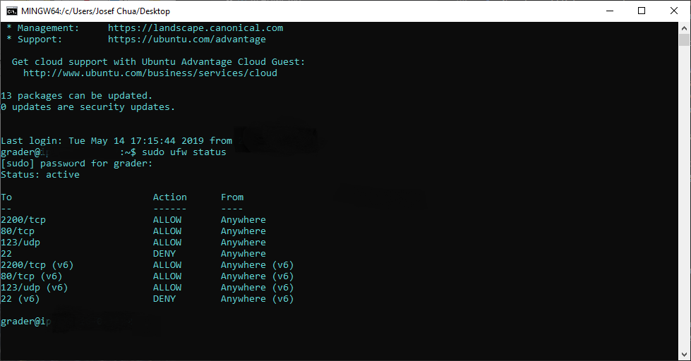

# Linux Server Configuration Udacity Full Stack Nanodegree Project

You will take a baseline installation of a Linux server and prepare it to host your web applications.
You will secure your server from a number of attack vectors, install and configure a database server,
and deploy one of your existing web applications onto it.

- Website : http://52.37.178.176.xip.io/ or http://52.37.178.176
- Public IP address: 52.37.178.176
- SSH port: 2200
- Password for `Grader` user: grader

## Step 1: Create a Ubuntu Linux Server on Amazon Lightsail

1. Create an AWS account
2. Click **Create instance** button on the home page
3. Select **Linux/Unix** platform
4. Select **OS Only** and **Ubuntu** as blueprint
5. Select an instance plan
6. Name your instance
7. Click **Create** button

## Step 1.1: Creating a static IP Address

1. Select your server name.
2. Click `Networking`
3. Click `Create static IP`
4. Select server you want to create the static IP for.
5. Press `Create` to have your own static public ip.

## Step 2: SSH into your Linux Server

1. Download the private key from [here](https://lightsail.aws.amazon.com/ls/webapp/account/keys). The file name should be `LightsailDefaultKey-us-west-2.pem`.
2. Create a folder `.ssh` at the file path here `C:\Users\USERNAME_GOES_HERE\` if you have not made one already.
3. In the `.ssh` folder create a file called `lightsail_key.rsa` and copy the contents of `LightsailDefaultKey-us-west-2.pem` into it.
4. Open `git bash` in the folder `.ssh` and set the permission as owner only using this command: `chmod 600 ~/.ssh/lightsail_key.rsa`
5. Finally SSH into your server using this command: `ssh -i ~/.ssh/lightsail_key.rsa ubuntu@XXX.XXX.XXX.XXX`

- Note: Replace the XXX.XXX.XXX.XXX with your ip address.

## Step 3: Update all packages on your server

1. Run `sudo apt-get update` to update packages
2. Run `sudo apt-get upgrade` to upgrade to the new version
3. Set for future updates: `sudo apt-get dist-upgrade`

## Step 4: Change your port from 22 to 2200

1. Run `sudo nano /etc/ssh/sshd_config` to open up the configuration file.
2. Look for the line that says `Port 22` and change it to `Port 2200`.
3. Save and exit the file.
4. Restart SSH: `sudo service ssh restart`
5. Go into your Amazon Lightsail homepage, and click Networking.
6. Scroll down and remove SSH from the list.
7. Add `Custom TCP 2200` and `Custom UDP 123`

## Step 5: Configure the firewall

1. Check firewall status: \$ sudo ufw status
2. Set default firewall to deny all incomings: \$ sudo ufw default deny incoming
3. Set default firewall to allow all outgoings: \$ sudo ufw default allow outgoing
4. Allow incoming TCP packets on port 2200 to allow SSH: \$ sudo ufw allow 2200/tcp
5. Allow incoming TCP packets on port 80 to allow www: \$ sudo ufw allow www
6. Allow incoming UDP packets on port 123 to allow NTP: \$ sudo ufw allow 123/udp
7. Close port 22: \$ sudo ufw deny 22
8. Enable firewall: \$ sudo ufw enable
9. Check out current firewall status: \$ sudo ufw status
10. Update the firewall configuration on Amazon Lightsail website under Networking. Delete default SSH port 22 and add port 80, 123, 2200
11. Open up a new terminal and you can now ssh in via the new port 2200: \$ ssh -i ~/.ssh/lightsail_key.rsa ubuntu@18.218.99.181 -p 2200

### Example

## Step 6: Add a new user

1. Create a new user: `sudo adduser grader`
2. Log into the newly created account with `su - grader`
3. Create a new file under this path: `sudo nano /etc/sudoers.d/grader`
4. Add this line of code `grader ALL=(ALL:ALL) ALL`.
5. Save and exit.

## Step 7: Allow new user to SSH in

1. Create a SSH key-pair for user `grader` using `ssh-keygen` tool on your local machine. Name it and save the file in ~/.ssh path.
2. Once created open the contents of the file with the extension `.pub` and copy it.
3. Go back onto your virtual machine while still logged in at `grader` create a directory called `.ssh`.
4. Create a file named `authorized_keys` in `.ssh` folder using: `sudo nano .ssh/authorized_keys` and paste the contents from the `.pub` file.
5. Change the permissions of `.ssh` using `chmod 700` and `.ssh/authorized_keys` using `chmod 644`.
6. Restart SSH: `sudo service ssh restart`
7. Logout of user `Ubuntu` and try logging into user `grader` using this: `ssh -i ~/.ssh/grader_key -p 2200 grader@XXX.XXX.XXX.XXX`.

## Step 8: Set timezone to UTC

1. Run `sudo dpkg-reconfigure tzdata`
2. Choose **None of the Above** and than select **UTC**

## Step 9: Install Apache

1. Install Apache: `sudo apt-get install apache2
2. Go to your public ip address and see if the **Apache2 Ubuntu Default Page** shows up.

## Step 10: Install Python mod_wsgi

1. Install the mod_wsgi package with: `sudo apt-get install libapache2-mod-wsgi python-dev`
2. Enable mod_wsgi: `sudo a2enmod wsgi`
3. Restart Apache: `sudo service apache2 restart`

## Step 11: Install PostgreSQL
